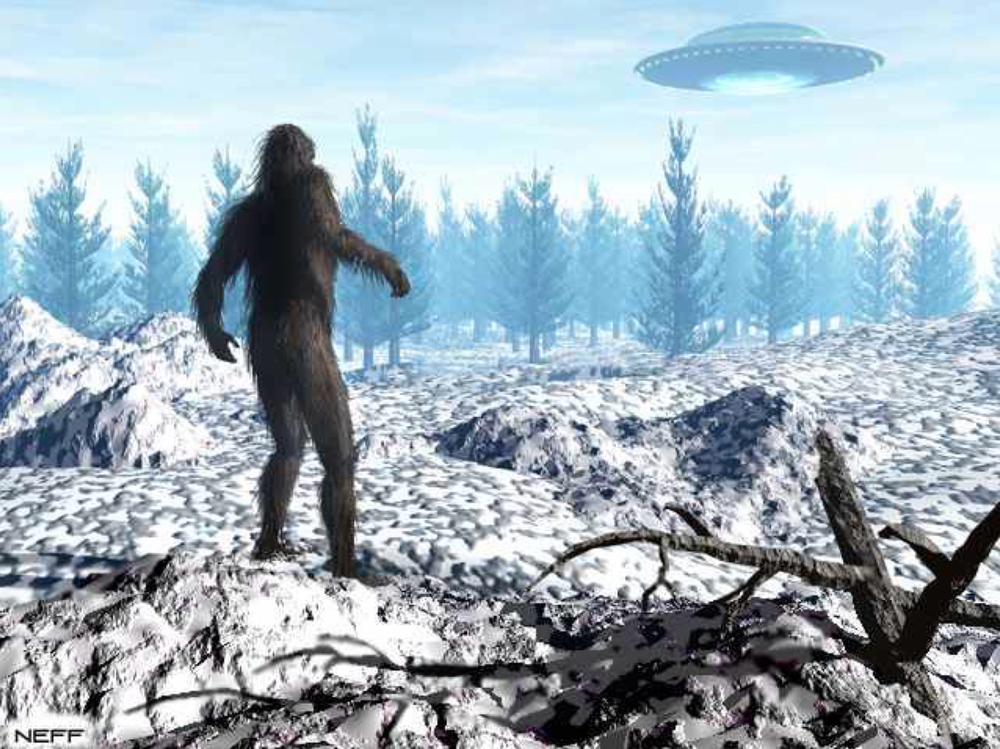
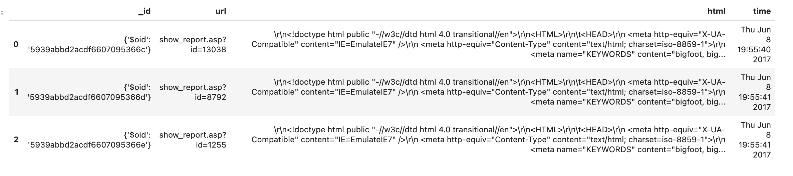
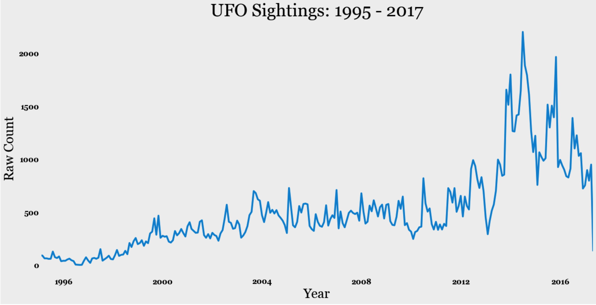
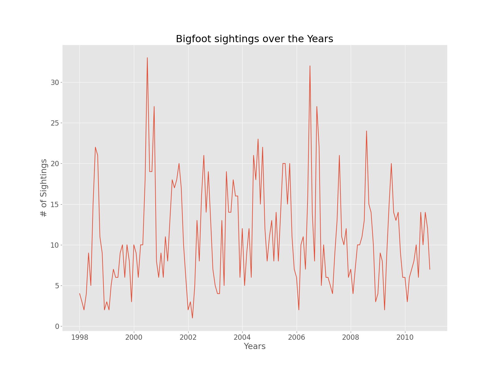
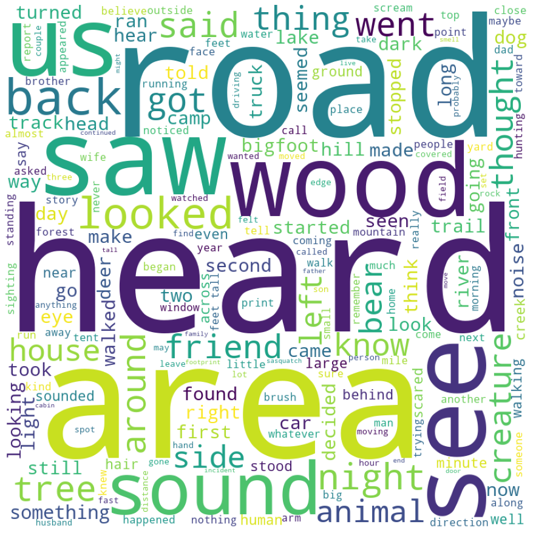
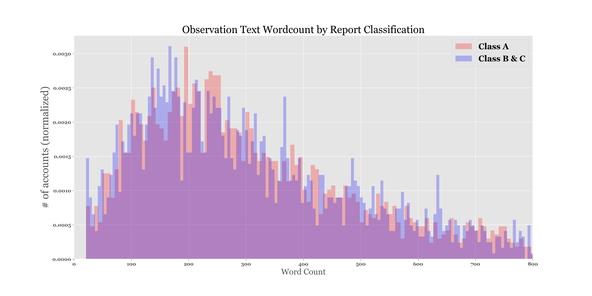
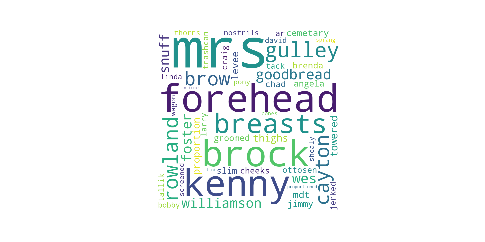
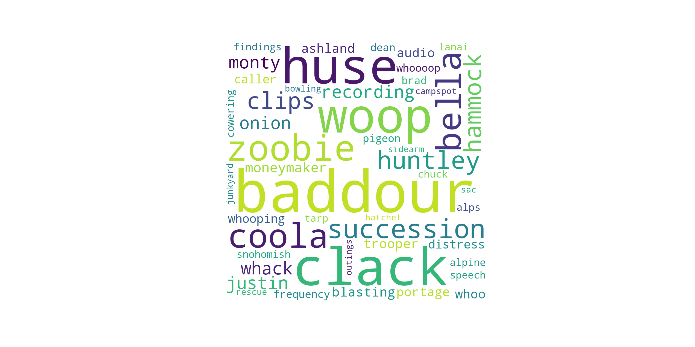
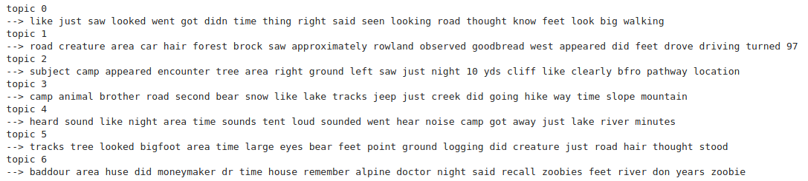

# 
 Analyzing Bigfoot and UFO Sightings in the United States

### Background and Objectives

In the United States, thousands of people have claimed to witness Bigfoot and UFO sightings nationwide. With these two types of sightings, our team wanted to investigate the relationships by analyzing web-scraped data from [The National UFO Reporting Center Online Database](http://www.nuforc.org/webreports.html) and [Geographic Database of Bigfoot / Sasquatch Sightings & Reports Database](http://www.bfro.net/gdb/). Some of the initial relationships we wanted to evaluate were geographical location of sightings, seasonality of sightings, quantity of sightings through the years and an analysis of text for each type of sighting. Additionally, we wanted to build a machine learning algorithm to see if we could predict which type of sighting was observed based on the text of the report using Natural Language Processing (NLP). 

### Initial Assumptions

Prior to starting our analysis, we wanted to gather our initial assumptions and compare them with the real life data. Some of our assumptions included:

* There are going to be significantly more UFO sightings than Bigfoot sightings in the U.S.
* The decade with the most UFO sightings will be in the 1980's while the decade with most Bigfoot sightings is 1970's
* The U.S. region with the most UFO sightings will be in the Southwest while Bigfoot sightings will be in Northwest
* The majority of the Bigfoot sightings occur in the colder months while the majority of UFO sightings occur in the summer

### Raw Data Review

From the DataFrame object we are only interested in the 'html', which needs further parsing using beautifulsoup.  

- In the bigfoot dataset the following fields were extracted from HTML:  `Month, Year, County, State, Class, Observations`.  
- In the UFO dataset the following fields were used in the analysis: `text', 'occurred', 'reported', 'posted', 'location', 'shape','duration'`

### Exploratory Data Analysis 

As you can see there seems to be some sort of trend happening with gigantic spikes kept hitting points near the fall seasons of each year, and falls drastically during the winter season of each year. This made me want to check the seasonal trends throughout my data and see if I was right about which seasons saw the most bigfoot activity.

  

. 
  
  
- Largest numbers of sightings occur on the West Coast, with a surprising number in the Pacific Northwest.  
- Sightings are highly correlated with major metropolitan areas (except for New York City)
- Surprised that there wasn't a greater concentration in New Mexico.   
  

  

.  
  
- Would have been nice to correlate shapes with time, date, or location
  

  

.  

UFO sighting description wordcloud

Bigfoot sighting description wordcloud

### Data Cleaning Process

* (Include synopsis of how we had to clean the data i.e. converting duration values to integers, converting datetime, converting locations, etc)

### Machine Learning Algorithms 

* NLP Algorithm discussion --- PCA or NMF for finding the most 'important features' or words of each type of report

#### Multinomial Naive Bayes
Text from the bigfoot descriptions was fit to a Naive Bayes model to predict if a sighting was a Class A or Class B/C.  Class A sightings are sightings where "clear sightings in circumstances where misinterpretation or misidentification of other animals can be ruled out with greater confidence".  On splitting the data set between Classes the length of the descriptions were compared in a histogram to show each have similar lengths:

A test-train split was made (20/80) on the data set and the model performed with 80% accuracy on the test data.  After cleaning tokenizing the 75 words most likely to distinguish a Class A event were determined:

And Class B predictors:

1970: A family of bigfoot-like creatures called "zoobies" was observed on multiple occasions by a San Diego psychiatrist named Dr. Baddour

### ML Example 1 (include tuning / evaluation notes)

### Bigfoot Sighting Analysis Using Non-Negative Matrix Factorization:

As a group, we decided to take the Top 3 states that reported Bigfoot observations (Washington, California and Florida) and analyze the descriptions using Non-Negative Matrix Factorization (NMF). So, we took all the observations from those 3 states (1,192 observations total) and created a “Bag of Words” matrix for our analysis after removing all of the desired stop-words. Our rows in the matrix were the individual Bigfoot observations and the columns were the individual words with associated term frequencies. We ran our NMF algorithm for a series of values of k and thought the value of k = 7 was the most enlightening (see table below):

Here are some interesting findings from the various topics that were modeled using NMF:

Topic 4: Seems to correlate the observations with camping outside at night and waking up to an loud noise because you see the words “tent, camp, night, noise, heard, etc.”

Topic 3: Appears to capture observations in the winter and likely in Washington because of the words “snow and mountain”

Topic 6: This is an interesting topic because it picks up the words “zoobie”, “zoobies”, "baddour". After doing some research online, we found a Dr. Baddour who was a San Diego psychiatrist who called a family of bigfoot-like creatures "zoobies".
