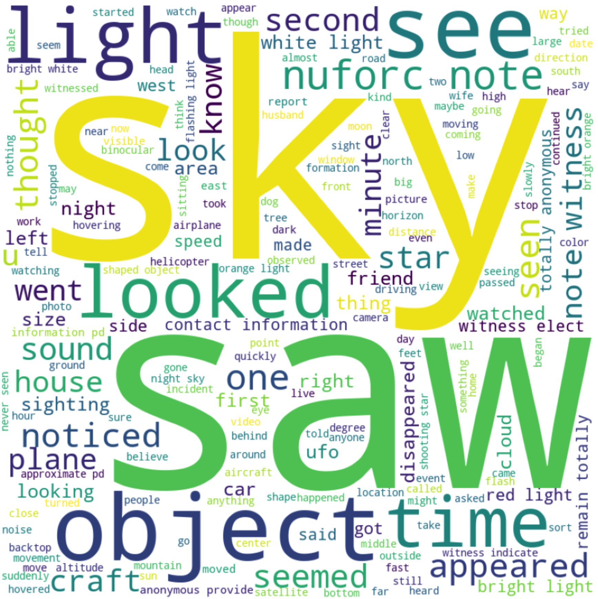

# <div align="center"> Analyzing Bigfoot and UFO Sightings in the United States


### Background and Objectives

In the United States, thousands of people have claimed to witness Bigfoot and UFO sightings nationwide. With these two types of sightings, our team wanted to investigate the relationships by analyzing web-scraped data from [The National UFO Reporting Center Online Database](http://www.nuforc.org/webreports.html) and [Geographic Database of Bigfoot / Sasquatch Sightings & Reports Database](http://www.bfro.net/gdb/). Some of the initial relationships we wanted to evaluate were geographical location of sightings, seasonality of sightings, quantity of sightings through the years and an analysis of text for each type of sighting. Additionally, we wanted to build a machine learning algorithm to see if we could predict which type of sighting was observed based on the text of the report using Natural Language Processing (NLP). 

### Initial Assumptions

Prior to starting our analysis, we wanted to gather our initial assumptions and compare them with the real life data. Some of our assumptions included:

* There are going to be significantly more UFO sightings than Bigfoot sightings in the U.S.
* The decade with the most UFO sightings will be in the 1980's while the decade with most Bigfoot sightings is 1970's
* The U.S. region with the most UFO sightings will be in the Southwest while Bigfoot sightings will be in Northwest
* The majority of the Bigfoot sightings occur in the colder months while the majority of UFO sightings occur in the summer

### Raw Data Review


From the DataFrame object we are only interested in the 'html', which needs further parsing using beautifulsoup.  In the bigfoot dataset the following fields were extracted from HTML: ```Month, Year, County, State, Class, Observations```.  

### Exploratory Data Analysis 


As you can see there seems to be some sort of trend happening with gigantic spikes kept hitting points near the fall seasons of each year, and falls drastically during the winter season of each year. This made me want to check the seasonal trends throughout my data and see if I was right about which seasons saw the most bigfoot activity.

<p align="center">
  <a href="https://americanthinker.github.io/NLP_Case_Study/">
  
  </a>
</p> 


UFO sighting description wordcloud


Bigfoot sighting description wordcloud

### Data Cleaning Process

* (Include synopsis of how we had to clean the data i.e. converting duration values to integers, converting datetime, converting locations, etc)

### Machine Learning Algorithms 

* NLP Algorithm discussion --- PCA or NMF for finding the most 'important features' or words of each type of report

#### Multinomial Naive Bayes
Text from the bigfoot descriptions was fit to a Naive Bayes model to predict if a sighting was a 'Class A' or 'Class B/C' sighting

### ML Example 1 (include tuning / evaluation notes)

### ML Example 2 (include tuning / evaluation notes)

### Conclusion 
